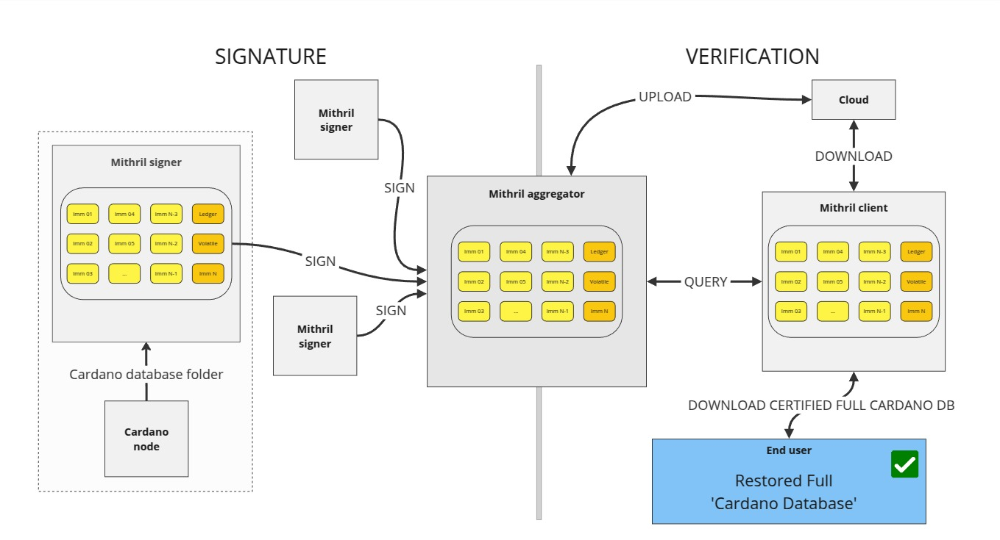

# Cardano node database

## Introduction

The Mithril protocol supports the certification of the **Cardano node internal database**, enabling fast bootstrapping of a Cardano node. This is particularly useful for full-node wallets, SPOs, and layer 2 protocols that need to operate full Cardano nodes.

To achieve this, Mithril signers and aggregators independently compute a message representing the immutable files of the Cardano node internal database and apply the Mithril protocol to jointly sign it.

:::info

The Cardano node internal database:

- Exceeds `150 GB` on the Cardano mainnet
- Can be bootstrapped in `~20 minutes` with Mithril
- Takes over `24 hours` without Mithril.

:::

## Mithril certification

<small>
End-to-end certification for Cardano transactions
</small>

:::info

Learn about the Mithril certification steps [here](./README.mdx).

:::

### Message computation

The message is the hash of the concatenation of the immutable files in the Cardano node internal database:

- the hash of the immutable files is computed with `SHA256` of their binary content
- the message is computed with `SHA256` of the concatenation of the hashes of the immutable files
- the last immutable file, the ledger state and the volatile can not be signed as they are not deterministically computed by the Cardano node.

The message computation is the same on the signers and the aggregators.

<small>
Message creation on the signers and aggregators
</small>

### Authenticity verification

The verification process operates on the full Cardano node internal database:

- the client downloads a compressed artifact from an untrusted source (e.g. an aggregator or a cloud service)
- the client computes the message from the downloaded artifact and verifies that it is signed by a valid Mithril certificate.

<small>
Message creation on the clients (same as on signers and aggregators)
</small>
