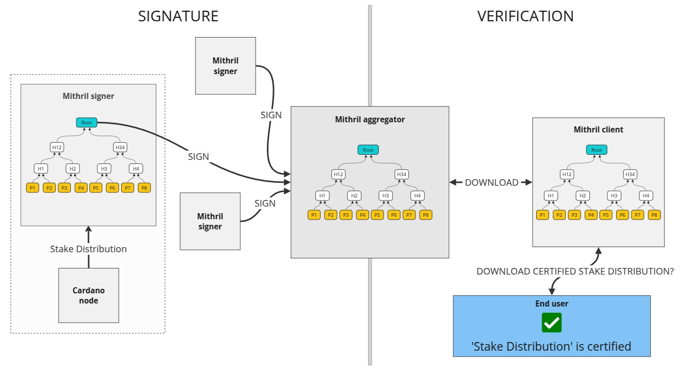

# Cardano stake distribution

The Mithril protocol supports the certification of the **Cardano stake distribution**, allowing users to verify the actual stake held by one or more SPOs at a given Cardano epoch. This is particularly useful for bridges, sidechains, or other types of layer 2 protocols that need to rely on limited committees for their operations.

To achieve this, Mithril signers and aggregators independently compute a message representing the Cardano stake distribution and apply the Mithril protocol to jointly sign it.

A natural structure for the message is a **Merkle tree**, which is succinctly represented by its **Merkle root** (the actual signed message).

:::info

The stake distribution is:

- Composed of `~3,000` SPOs on the Cardano mainnet
- Computed at the epoch boundary with the following epoch (as it evolves during an epoch and is only final at the end of the epoch).

:::

<small>
Stake distribution snapshots done by the Cardano node
</small>

## Mithril certification

<small>
End to end certification for Cardano transactions
</small>

:::info

Learn about the Mithril certification steps [here](./README.mdx).

:::

### Message computation

The message is the Merkle root of the Merkle tree, where the leaves are the hashes of the tuple composed of:

- The **pool ID**, which is the unique identifier of an SPO in the Cardano network (computed as the hash of the Cardano pool's **cold verification key**, which is `bech32` encoded, eg, `pool1r0tln8nct3mpyvehgy6uu3cdlmjnmtr2fxjcqnfl6v0qg0we42e`)
- The **stake** delegated to the SPO at the given epoch in `lovelace` (`1 ada` = `1,000,000 lovelace`).

The message computation is the same for both signers and aggregators.

<small>
Message creation on the signers and aggregators
</small>

:::info

The Merkle tree inner nodes are computed with the `BLAKE2s-256` hash function: the child bytes are concatenated and hashed to compute the parent node.

:::

### Authenticity verification

Due to the relatively small size of the stake distribution, the computation of the Merkle tree is quick and can be performed on the client side:

- The client downloads the serialized Cardano stake distribution from an artifact delivered by an aggregator
- The client computes the Merkle root (the message) and verifies that it is signed by a valid Mithril certificate.

<small>
Message creation on the clients (same as on signers and aggregators)
</small>
