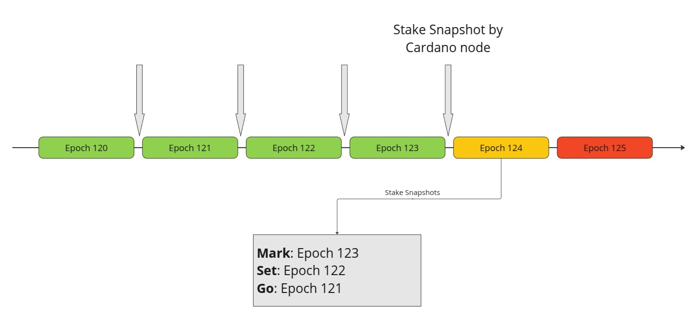

# Cardano stake distribution

## Introduction

The Mithril protocol supports the certification of the **Cardano stake distribution**. This allows users who aim to verify the actual stake held by one or more SPOs at a given Cardano epoch.
This is particularly useful for bridges, sidechains or other types of layer-2 protocol that need to rely on limited committees for their operations.

To do so, the Mithril signers and aggregators independently compute a message which represents the **Cardano stake distribution** and apply the Mithril protocol to jointly sign it.

A natural structure for the message is a **Merkle tree** which can be represented succinctly by its **Merkle root** (the actual message signed).

:::info

It is worth mentioning that the stake distribution is:

- composed of `~3,000` SPOs on the Cardano mainnet
- computed at the epoch boundary with the following epoch (as its is evolving during an epoch and is only final at the end of the epoch).

:::

<small>
Stake distribution snapshots done by the Cardano node
</small>

## Mithril certification

The Mithril certification is generally done with the following steps:

- the **signers** compute the message which represents the type of information to sign, and then broadcast it to the aggregators
- the **aggregators** compute the same message which represents the type of information to sign, collect the signatures from the signers and attempt to aggregate them into a multi-signature
- the **clients** download "artifacts" from an untrusted source (e.g. an aggregator, a cloud service, or a peer-to-peer network), re-compute the same message which represents the type of information to verify, and verify that the message is signed by a valid Mithril multi-signature.

<small>
End to end certification for Cardano transactions
</small>

### Message computation

The message is the Merkle root of the Merkle tree whose leaves are the hashes of the tuple composed of:

- the **pool id** which is the unique id of a SPO in a Cardano network (computed as the hash of the Cardano pool's **cold verification key** which is `bech32` encoded, e.g. `pool1r0tln8nct3mpyvehgy6uu3cdlmjnmtr2fxjcqnfl6v0qg0we42e`)
- the **stake** delegated to the SPO at the given epoch in `Lovelace` (`1 ADA` = `1,000,000 Lovelace`).

The message computation is the same on the signers and the aggregators.

<small>
Message creation on the signers and aggregators
</small>

:::info

The Merkle tree inner nodes are computed with the `BLAKE2s-256` hash function: the children bytes representation are concatenated and hashed to compute the parent node.

:::

### Authenticity verification

Given the very limited size of the stake distribution, the computation of the Merkle tree is very fast and can be done on the client side:

- the client downloads the serialized Cardano stake distribution from an artifact delivered by an aggregator
- the client computes the Merkle root (the message) and that it is signed by a valid Mithril certificate.

<small>
Message creation on the clients (same as on signers and aggregators)
</small>
