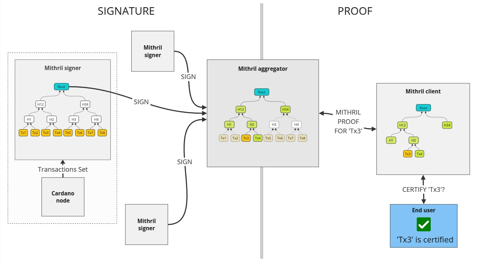
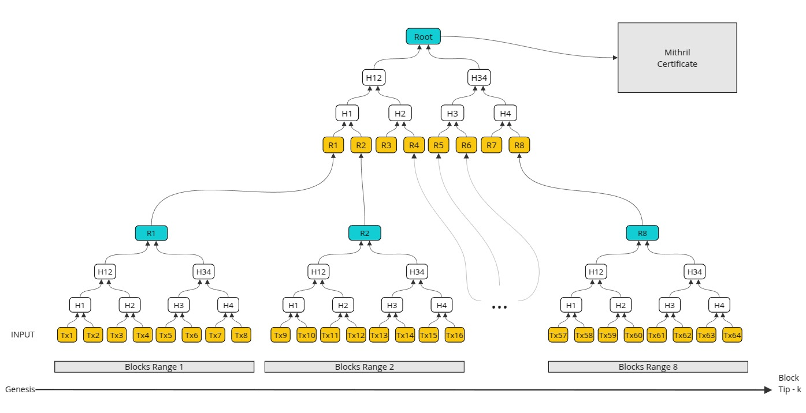
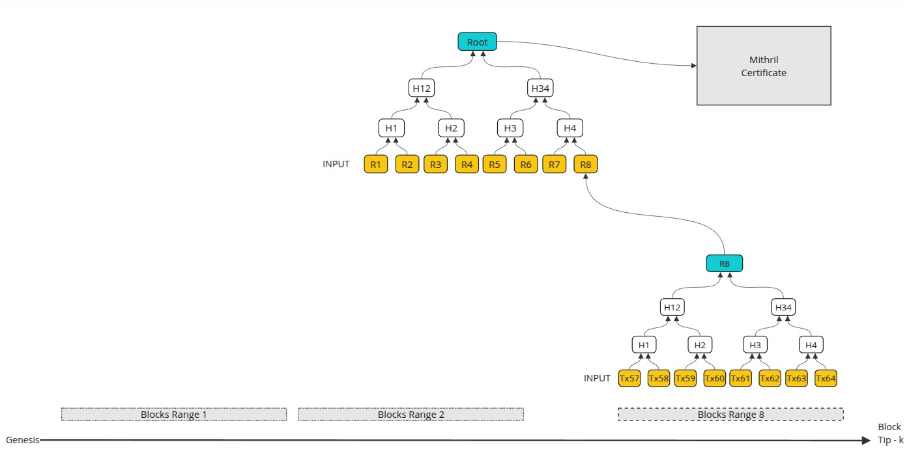

# Cardano transactions

The Mithril protocol supports the certification of the **full Cardano transactions set (since genesis)**. This allows users to verify a transaction's authenticity without downloading the entire Cardano blockchain.
This is particularly useful for lightweight clients, such as mobile wallets, which may lack the resources to store the entire blockchain.

To achieve this, Mithril signers and aggregators independently compute a message representing the **Cardano transaction set** and apply the Mithril protocol to jointly sign it. A proof of membership is then generated on demand for the subset of transactions a Mithril client attempts to verify. This proof can be validated against the signed message, which is included in the Mithril certificate.

A natural structure for the message is a **Merkle tree**, which:

- Can be succinctly represented by its **Merkle root** (the signed message)
- Allows for membership proof of a transaction in the set by providing the **Merkle path** from the transaction to the root.

This certification is conducted under high constraints when operating on the Cardano mainnet:

- The current Cardano transaction set exceeds `100 million` transactions
- The Mithril signer footprint must remain minimal (low memory, low CPU, low disk space)
- On-demand generation of the proof of membership must be fast and scalable to high throughput.

:::info

Another consideration is the finality of the Cardano chain itself: the closer we examine the tip of the chain, the more likely blocks can be rolled back, potentially invalidating transactions. However, the Mithril protocol is designed to offer certification with high guarantees. As an initial implementation, we have chosen to certify the transaction set at a **fixed offset from the tip of the chain** (currently `100` blocks on the Cardano mainnet). This balances finality guarantees and the latency required for Mithril to certify a transaction after submission.

The distance from the tip at which the transaction set is certified affects the Mithril protocol itself: the closer to the tip, the more likely some signers may operate on a temporary fork of the Cardano chain (which will later be rolled back), potentially preventing the quorum needed to create a valid multi-signature. The offset can be adjusted as a Mithril network parameter.

It is also worth noting that a new signature round is **triggered at a constant pace** (every `30` blocks on the Cardano mainnet).

:::

## Mithril certification

<small>
End to end certification for Cardano transactions
</small>

:::info

Learn about the Mithril certification steps [here](./README.mdx).

:::

### Message computation

Creating a Merkle tree with `100 million` leaves is impractical due to high memory usage and long computation times, which exceed the operational capacity of the signer. However, a **Merkle forest** offers a suitable solution. In this structure, the leaves of the signed Merkle tree are the roots of separate Merkle trees, each representing a contiguous block range. Each Merkle tree’s leaves are the transaction hashes within those blocks.

This structure is nearly append-only for transactions, allowing for some stored data compression when not used to create a membership proof. As a result, the volumes of information stored on signers and aggregators differ.

The blocks are divided into **block ranges** of `15` blocks. The leaves of the Merkle trees are the hashes of the transactions in the blocks within each range (`~150-1.5k` transactions per block range on the Cardano mainnet).
This reduces the number of leaves in the Merkle forest to approximately `1 million` on the Cardano mainnet – about `100` times fewer than the number of transactions in the blockchain.
This allows the creation of a Merkle forest with, on average, `100` times fewer leaves than the number of transactions in the Cardano blockchain (`~1` million leaves on the Cardano mainnet).

<small>
Message creation when aggregating on the aggregator
</small>

The process is almost the same on the signer, except that the transactions of the block ranges are ephemerally stored and only their compressed representation is kept in the long run (the Merkle root of the block range Merkle tree) once the blocks are final (older than `k` blocks from the tip of the chain, `2160` on the Cardano mainnet). This allows drastic compression of the storage on the signers.

<small>
Message creation when signing on the aggregator
</small>

:::info

The Merkle tree inner nodes are computed with the `BLAKE2s-256` hash function: the child bytes are concatenated and hashed to compute the parent node.

:::

### Authenticity verification

The verification process operates on a subset of the Cardano set that can be certified (fully or partially):

- The client calls a prover route exposed by the aggregator, which computes a **Merkle proof of membership** for the transactions signed in the latest snapshot
- The client verifies that the proof of membership is valid and that its Merkle root (the message) is signed by a valid Mithril certificate.

<small>
Proof creation done by the aggregator _(to verify 'Tx4' and `Tx62')_
</small>
